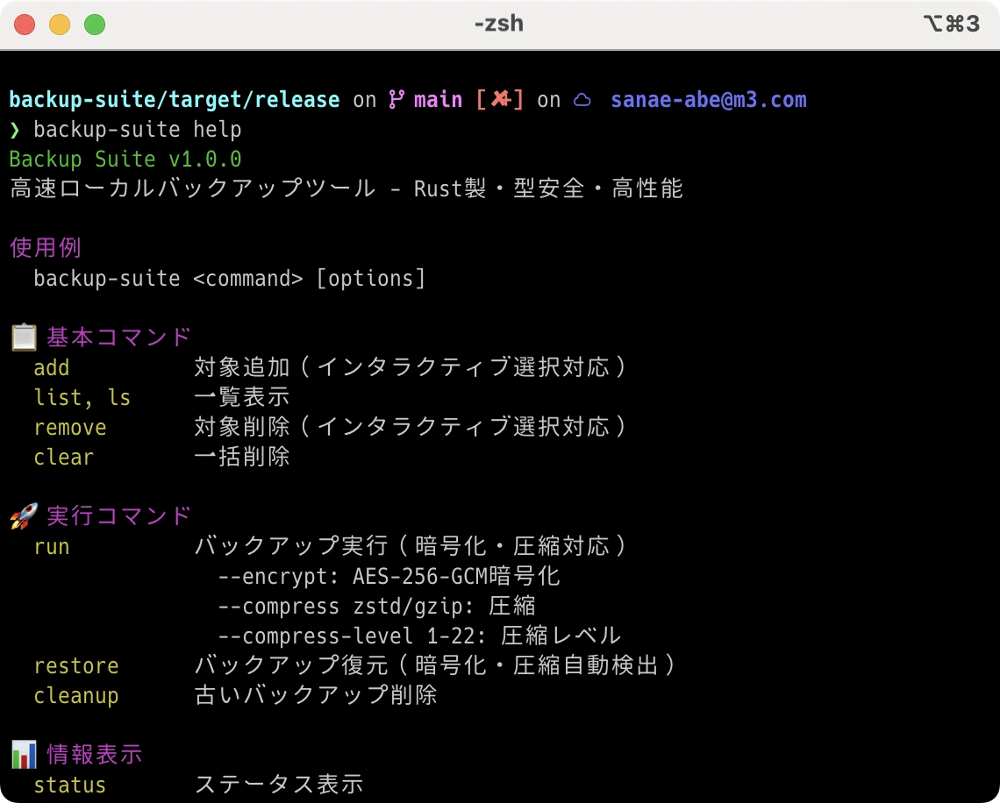
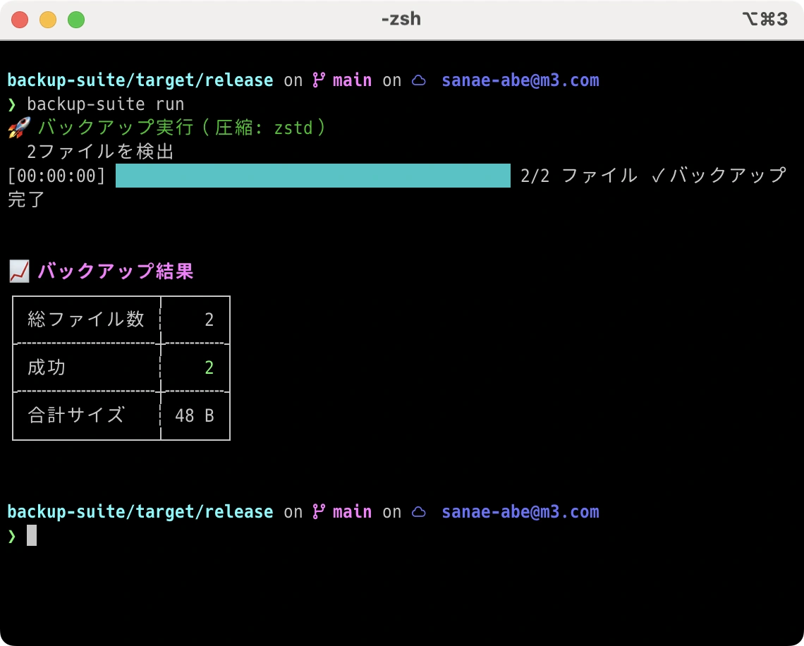
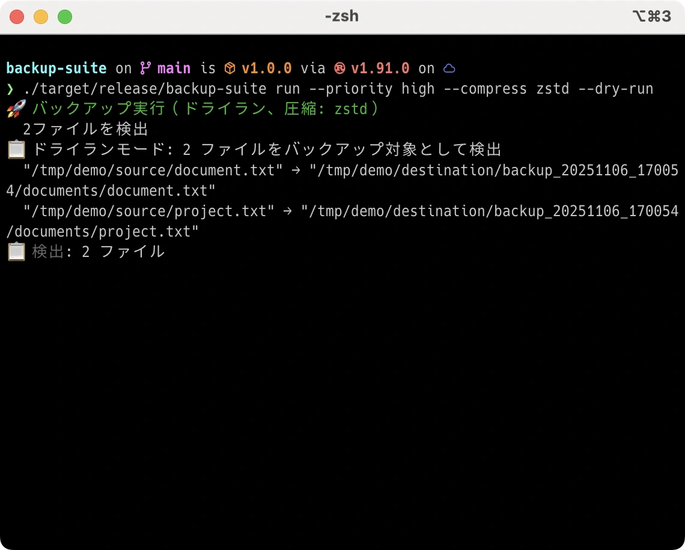
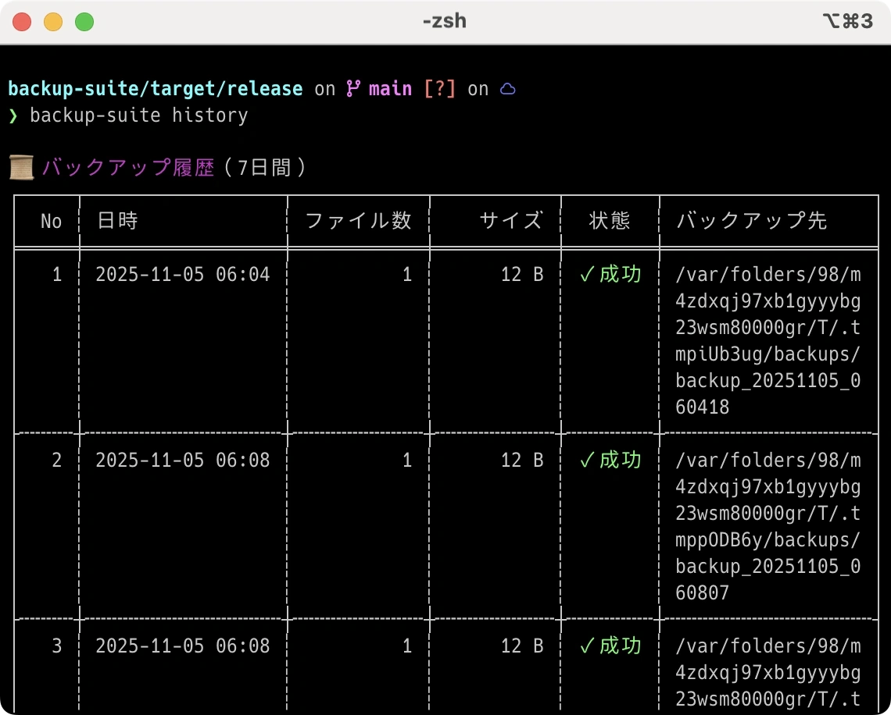

# Backup Suite

[](https://opensource.org/licenses/MIT)
[](https://www.rust-lang.org)
[](https://github.com/user/backup-suite/releases)

**🦀 Fast, Type-Safe, and Intelligent Local Backup Tool**

Backup Suite is a high-performance CLI tool **built with Rust**. It delivers efficient backup workflows through priority-based management, automatic scheduling, and interactive file selection.

## ✨ Key Features

### 🎯 **Priority-Based Backup Management**
```bash
backup-suite add ~/important-docs --priority high --category work
backup-suite add ~/photos --priority medium --category personal
backup-suite run --priority high  # Execute high-priority backups only
```

### 🎨 **Interactive File Selection (skim Integration)**
```bash
backup-suite add --interactive     # Select files with beautiful UI
backup-suite remove --interactive  # Select from existing targets to remove
```

### ⏰ **Automatic Scheduling (Full macOS launchctl Integration)**
```bash
backup-suite schedule setup --high daily --medium weekly --low monthly
backup-suite schedule enable      # Enable automatic execution for all priorities
backup-suite schedule status      # Check current settings
```

### 📊 **Comprehensive Management Features**
```bash
backup-suite dashboard            # Statistics dashboard
backup-suite history --days 30    # Execution history for the last 30 days
backup-suite cleanup --days 7     # Delete backups older than 7 days
backup-suite restore             # Restore from latest backup
```

## 🚀 Installation

### Rust Toolchain Installation

```bash
# 1. Download and run Rustup (Rust installer)
curl --proto '=https' --tlsv1.2 -sSf https://sh.rustup.rs | sh

# 2. Load environment variables
source ~/.cargo/env

# Open a new terminal or run:
# bash users
source ~/.bashrc

# zsh users (macOS default)
source ~/.zshrc

# 3. Verify installation
rustc --version
cargo --version
```

### 🚀 backup-suite Installation

```bash
# 1. Clone repository
git clone git@rendezvous.m3.com:sanae-abe/backup-suite.git
cd backup-suite

# 2. Build & install
cargo install --path .

# 3. Verify operation
backup-suite --version
backup-suite --help
```

### 🔄 Update

```bash
# 1. Get latest source
cd backup-suite  # Project directory
git pull

# 2. Rebuild & install
cargo install --path . --force

# 3. Verify version
backup-suite --version
```

### 🧹 Uninstall

```bash
# 1. Remove backup-suite
cargo uninstall backup-suite

# 2. Delete configuration files (optional)
rm -rf ~/.config/backup-suite/

# 3. Delete log files (optional)
rm -rf ~/.local/share/backup-suite/

# 4. Delete project directory (optional)
rm -rf ~/backup-suite  # Cloned directory
```

### 🔧 Troubleshooting

#### Common Issues and Solutions

**Issue 1**: `rustc` or `cargo` command not found
```bash
# Solution: Install Rust toolchain
curl --proto '=https' --tlsv1.2 -sSf https://sh.rustup.rs | sh
source ~/.cargo/env

# Verify
rustc --version
cargo --version
```

**Issue 2**: Git clone access denied error
```bash
# Solution: SSH key setup or HTTPS authentication
# If SSH keys are configured
git clone git@rendezvous.m3.com:sanae-abe/backup-suite.git

# Or use HTTPS (requires GitLab login)
git clone https://rendezvous.m3.com/sanae-abe/backup-suite.git
```

**Issue 3**: Compilation errors occur
```bash
# Solution: Update Rust to latest version
rustup update stable
cargo clean  # Clear cache
cargo build  # Rebuild
```

**Issue 4**: `backup-suite` command not found
```bash
# Solution: PATH verification and addition
echo $PATH | grep -q "$HOME/.cargo/bin" || echo 'export PATH="$HOME/.cargo/bin:$PATH"' >> ~/.bashrc
source ~/.bashrc  # or ~/.zshrc

# Verify
which backup-suite
backup-suite --version
```

### Initial Setup
```bash
# Verify basic configuration
backup-suite status
```

### Basic Usage Examples

1. **Add Files**
```bash
backup-suite add ~/Documents/project --priority high --category development
backup-suite add ~/Photos --priority medium --category personal
```

2. **List Targets**
```bash
backup-suite list
backup-suite list --priority high  # High-priority only
```

3. **Execute Backup**
```bash
backup-suite run                   # Execute all targets
backup-suite run --priority high   # High-priority only
backup-suite run --category work   # Specific category only
backup-suite run --dry-run         # Dry run (verification only)
```

4. **Configure Automation**
```bash
# Set up priority-based schedules
backup-suite schedule setup --high daily --medium weekly --low monthly
backup-suite schedule enable
```

## 📸 Usage Examples Screenshots

### Help Screen

*Display commands and options in Japanese*

### Backup Target List

*Display registered backup targets in table format*

### Backup Execution

*Actual backup execution screen*

### Backup Execution (Dry Run)

*Verify execution content without actually copying files*

### Backup History

*Check past backup execution history*

## 🏗️ Architecture

### **Configuration File**: `~/.config/backup-suite/config.toml`
```toml
[backup]
destination = "/Users/user/backup-suite/backups"
keep_days = 30

[[targets]]
path = "/Users/user/Documents/projects"
priority = "high"
category = "development"
```

### **Technology Stack**
- **Language**: Rust 1.70+ (type-safe, memory-safe, high-performance)
- **CLI**: clap 4.x (command-line parsing, completion generation)
- **UI**: skim (beautiful fuzzy finder integration)
- **Configuration**: TOML (human-readable configuration format)
- **Scheduling**: macOS launchctl (system-level automation)

## 📋 Complete Command Reference

| Command | Description | Example |
|----------|------|-----|
| **add** | Add backup target | `backup-suite add ~/docs --priority high` |
| **list, ls** | List targets | `backup-suite list --priority medium` |
| **remove** | Remove target | `backup-suite remove ~/old-files` |
| **clear, rm** | Batch removal | `backup-suite clear --priority low` |
| **run** | Execute backup | `backup-suite run --dry-run` |
| **restore** | Restore backup | `backup-suite restore --from backup-20251104` |
| **cleanup** | Delete old backups | `backup-suite cleanup --days 30` |
| **status** | Display current status | `backup-suite status` |
| **history** | Display execution history | `backup-suite history --days 7` |
| **dashboard** | Statistics dashboard | `backup-suite dashboard` |
| **schedule** | Manage scheduling | `backup-suite schedule enable --priority high` |
| **open** | Open backup directory | `backup-suite open` |
| **--version** | Version information | `backup-suite --version` |
| **completion** | Generate shell completion | `backup-suite completion zsh` |

## 🔧 Advanced Usage

### Interactive Workflow
```bash
# Add targets with file selection UI
backup-suite add --interactive

# Select from existing targets to remove
backup-suite remove --interactive

# Cleanup with verification
backup-suite cleanup --days 30 --dry-run
```

### Priority-Based Operation Strategy
```bash
# Critical files: Daily backups
backup-suite add ~/critical-data --priority high --category critical

# Regular files: Weekly backups
backup-suite add ~/documents --priority medium --category work

# Archives: Monthly backups
backup-suite add ~/old-projects --priority low --category archive
```

### Restore & Disaster Recovery
```bash
# Restore from latest backup
backup-suite restore

# Restore from specific date
backup-suite restore --from backup-20251104 --to ~/recovered-files

# Verify contents before restoration
backup-suite history
```

## 🛡️ Security & Quality

### **Type Safety**
- Minimize runtime errors with Rust's powerful type system
- Memory safety guarantees (prevents buffer overflows and memory leaks)
- Compile-time error detection

### **Data Protection**
- Local-only (cloud-independent)
- Proper permission management for configuration files
- Validation before backup execution

### **Testing & Quality Assurance**
```bash
# Quality verification in the project
cargo test                        # Unit tests
cargo clippy                      # Static analysis
cargo fmt --check                # Format verification
```


## 📚 Documentation

### 👥 User Documentation
- [📦 Installation Guide](docs/user/INSTALL.md) - Detailed installation instructions
- [📖 Usage Guide](docs/user/USAGE.md) - Comprehensive feature explanations

### 🛠️ Developer Documentation
- [🏗️ Architecture](docs/development/ARCHITECTURE.md) - System design & extensibility
- [🧪 Testing Guide](docs/development/TESTING_GUIDE.md) - Test execution methods & strategies
- [🔒 Security Guide](docs/development/SECURITY_QUICK_REFERENCE.md) - Security best practices
- [❓ Help System](docs/development/HELP_IMPLEMENTATION_SUMMARY.md) - Help feature implementation

## 🤝 Contributing

Contributions to Backup Suite are welcome!

### Development Environment Setup
```bash
git clone https://github.com/user/backup-suite.git
cd backup-suite
cargo build
cargo test
```

### How to Contribute
1. Report issues or propose features via Issues
2. Submit improvements or fixes via Pull Requests
3. Contribute to documentation improvements or translations
4. Share your user experience feedback

## 📄 License

MIT License - See [LICENSE](LICENSE) file for details

## 🚀 Roadmap

### v1.1.0 (Planned)
- [ ] Linux systemd integration
- [ ] Windows support
- [ ] Configuration file encryption
- [ ] Incremental backup functionality

## 📞 Support

- **GitHub Issues**: [Bug reports & feature requests](https://github.com/user/backup-suite/issues)
- **Discussions**: [Questions & idea sharing](https://github.com/user/backup-suite/discussions)
- **Email**: support@backup-suite.example.com

---

**🦀 Backup Suite - Fast, Safe, and Intelligent Backup Solution**
